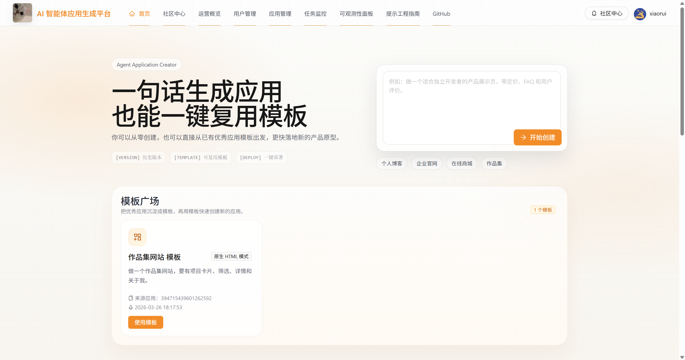
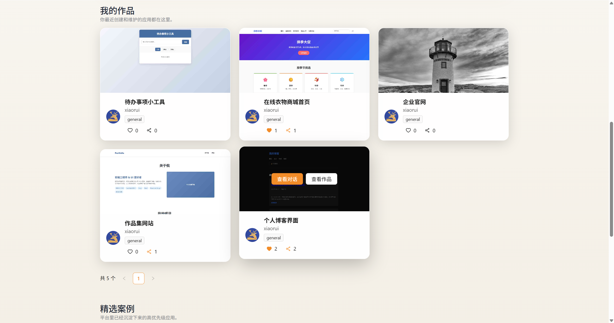
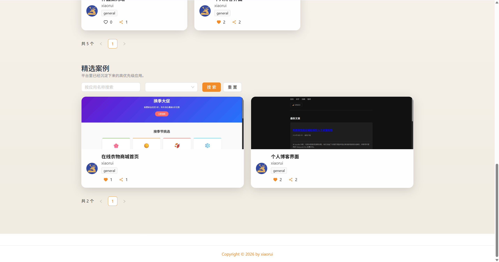
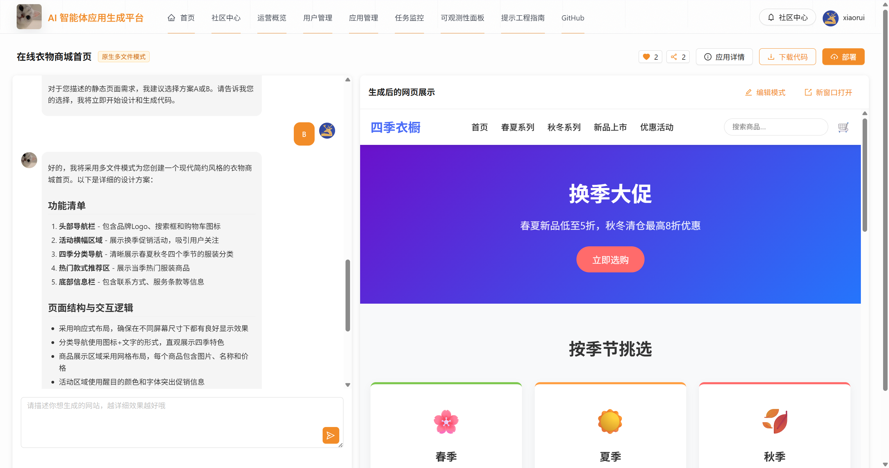
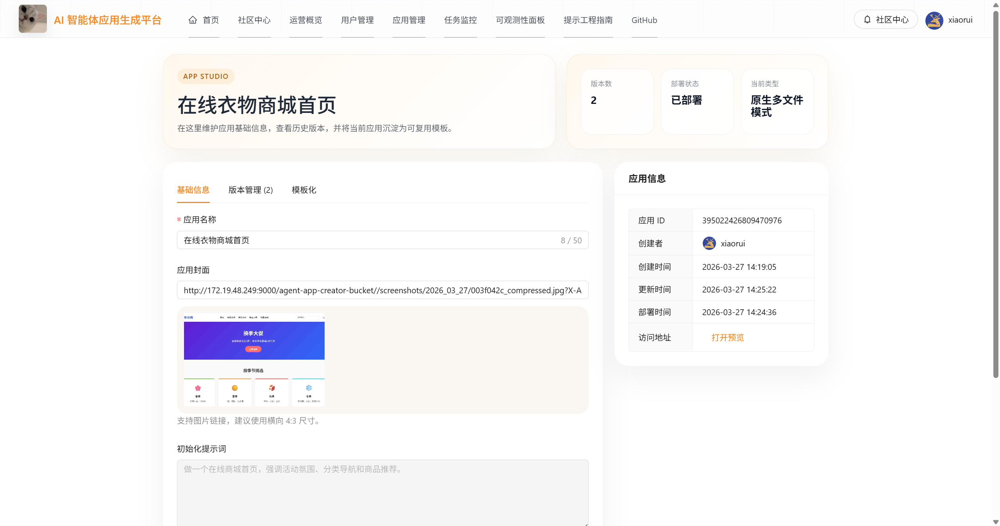
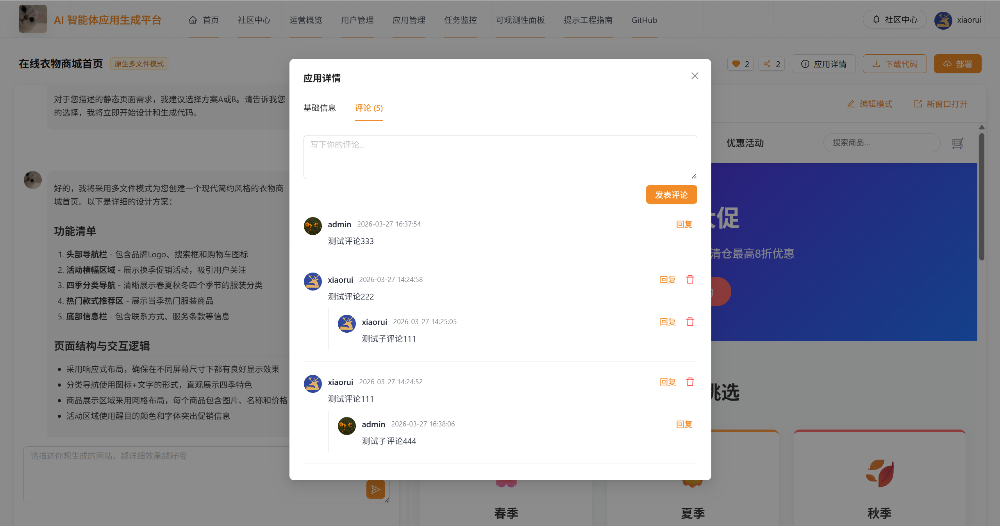
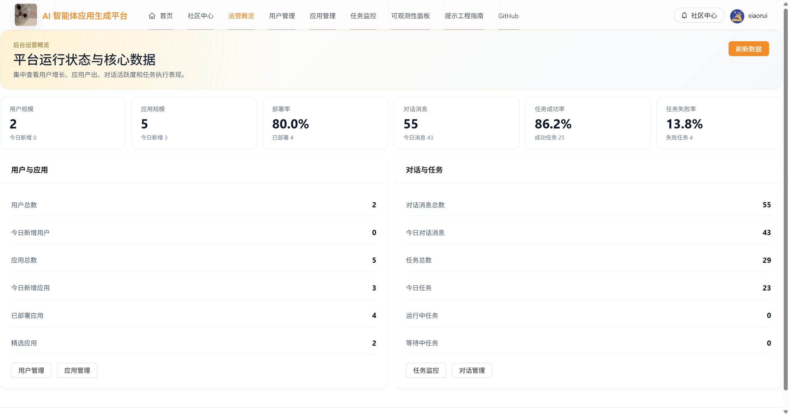
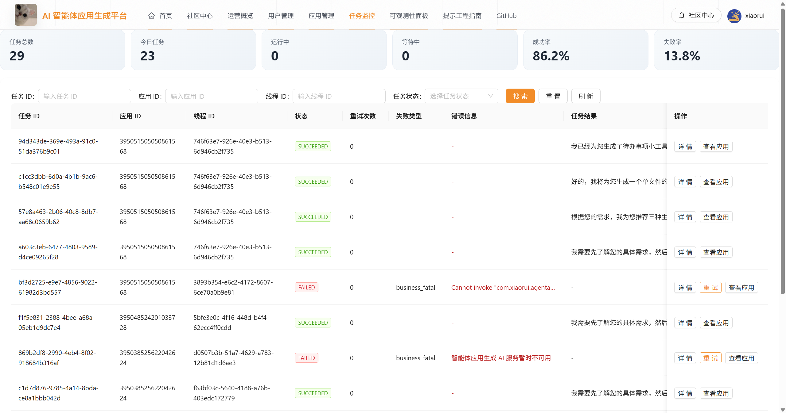
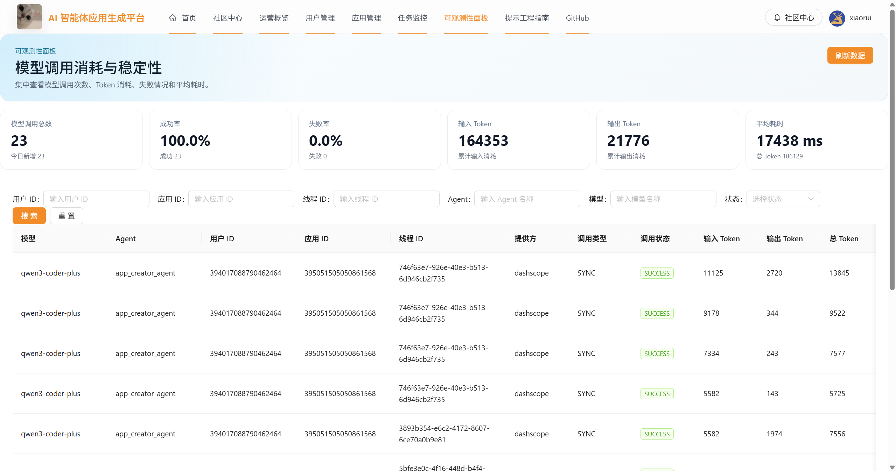
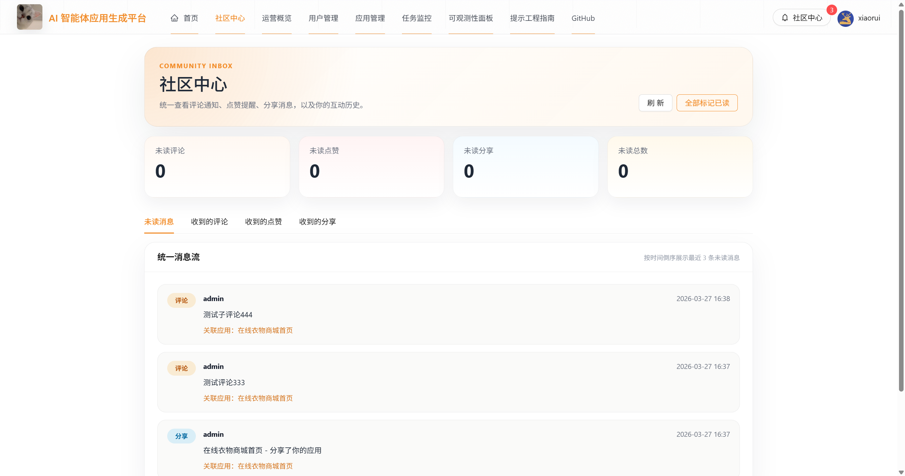

# AI 智能体应用生成平台

基于 `Spring Boot 3 + Spring AI Alibaba + Vue 3` 的 Agent 应用生成平台。  
项目面向“网页 / 小应用生成”场景，支持用户通过自然语言创建应用、继续对话迭代、预览、下载、部署，并提供模板广场、社区互动、后台运营与可观测性能力。

**_还有为了提交代码方便，一些本地配置 key 等信息就没有忽略提交了，还请不要搞我呢(￣﹃￣)_**

## 项目定位

这不是一个完全通用的 Agent 开发框架，而是一个更聚焦的：

**面向网页与小应用生成场景的 Agent 应用生成平台**

核心主链路是：

1. 用户输入一句自然语言需求创建应用
2. Agent 根据需求生成或修改代码
3. 前端在对话页展示回复与应用预览
4. 用户继续多轮对话迭代应用
5. 用户下载代码或一键部署
6. 平台提供模板、社区、后台管理、任务监控与模型调用可观测能力

## 核心能力

### 用户侧能力

- 自然语言创建应用
- 对话式继续修改应用
- 单文件 / Vue 项目两类代码生成
- 应用预览、下载、部署
- 应用版本快照与恢复
- 模板广场与基于模板创建应用
- 评论、点赞、分享、社区通知
- 账号注册、登录、重置密码、个人设置

### 平台侧能力

- 用户管理
- 应用管理
- 对话管理
- 任务监控与失败任务重试
- 运营概览面板
- 模型调用可观测性面板
  - 模型名
  - Agent 名称
  - userId / appId / threadId
  - promptTokens / completionTokens / totalTokens
  - 调用耗时 / 成功率 / 失败率

### Agent 相关能力

- 主 Agent 应用生成
- 代码修改计划校验与执行
- 副 Agent 代码优化
- 运行态线程绑定与上下文记忆
- 代码规范 / 文档类 RAG 检索支撑
- 异步任务执行与状态轮询

## 页面展示

### 首页





### 应用生成与详情





### 后台管理







### 社区



## 技术栈

### 后端

- `Spring Boot 3.5.6`
- `Spring AI Alibaba`
- `Spring AI Alibaba Agent Framework`
- `DashScope / 通义千问`
- `MyBatis-Flex`
- `Sa-Token`
- `Redis`
- `MySQL`
- `MinIO`
- `Redisson`
- `Knife4j + SpringDoc`
- `Micrometer + Prometheus`

### 前端

- `Vue 3`
- `TypeScript`
- `Vite`
- `Pinia`
- `Vue Router`
- `Ant Design Vue`
- `Axios`

### 环境要求

- `JDK 21`
- `Maven 3.8+`
- `Node.js 18+`
- `MySQL 8.0+`
- `Redis 7+`
- `MinIO`
- 可用的 DashScope API Key

## 项目结构

```text
agent-application-creator/
├─ src/main/java/com/xiaorui/agentapplicationcreator/
│  ├─ agent/                # Agent 编排、协议、计划执行、RAG、sub-agent
│  ├─ controller/           # 用户、应用、任务、社区、可观测性等接口
│  ├─ service/              # 业务逻辑
│  ├─ manager/              # 鉴权、监控、任务、部署等管理能力
│  ├─ model/                # DTO / Entity / VO
│  ├─ mapper/               # MyBatis-Flex 数据访问
│  ├─ config/               # 系统配置
│  └─ util/                 # 工具类
├─ src/main/resources/      # Spring Boot 配置
├─ app-creator-fronted/
│  └─ app-creator-fronted/
│     ├─ src/api/           # OpenAPI 生成接口与类型
│     ├─ src/components/    # 通用组件
│     ├─ src/pages/         # 首页、应用页、用户页、管理页
│     ├─ src/stores/        # Pinia 状态管理
│     └─ src/utils/         # 通用工具
├─ db/                      # 数据库脚本
├─ doc/                     # 设计文档与迭代文档
├─ page/                    # README 页面截图
└─ README.md
```

## 典型业务流程

### 1. 创建应用

1. 用户在首页输入需求
2. 后端创建应用记录
3. 前端跳转应用对话页
4. 用户继续发送需求，系统创建异步任务
5. Agent 生成结构化结果并落盘代码
6. 前端轮询任务状态并刷新预览

### 2. 模板复用

1. 用户将已有应用沉淀为模板
2. 模板进入模板广场
3. 用户选择模板快速创建新应用
4. 生成后的应用继续支持对话迭代

### 3. 后台运营

1. 管理员查看运营概览
2. 查看用户、应用、对话、任务整体情况
3. 在任务监控页查看失败任务并重试
4. 在可观测性面板查看模型调用与 Token 消耗

## 快速开始

### 1. 克隆项目

```bash
git clone https://github.com/xiaorui6110/agent-application-creator.git
cd agent-application-creator
```

### 2. 初始化数据库

先创建数据库，再执行 `db/` 目录中的建表与增量脚本。

示例：

```sql
CREATE DATABASE xiaorui_app_creator CHARACTER SET utf8mb4 COLLATE utf8mb4_unicode_ci;
```

如果你已经跑过项目，请确认后续新增表脚本也已执行，例如模型调用日志相关脚本。

### 3. 配置后端环境

请根据本地环境修改：

- `src/main/resources/application-dev.yml`

至少需要确认这些配置：

- MySQL
- Redis
- DashScope API Key
- MinIO
- SFTP / 部署目录
- 应用产物目录与部署域名

建议把敏感信息改为你自己的本地配置或环境变量，不要直接使用仓库中的示例值。

### 4. 启动后端

```bash
mvn clean install
mvn spring-boot:run
```

默认后端地址：

- API：`http://localhost:8123/api`
- Knife4j：`http://localhost:8123/api/doc.html`

### 5. 启动前端

进入前端目录：

```bash
cd app-creator-fronted/app-creator-fronted
npm install
npm run dev
```

常用命令：

```bash
npm run dev
npm run type-check
npm run build
npm run lint
```

默认前端开发环境会请求：

- `http://localhost:8123/api`

如有需要，可在前端环境变量中覆盖接口地址与部署域名。

## 主要路由

### 用户侧

- `/`：首页
- `/user/login`：登录页
- `/user/register`：注册页
- `/user/reset-password`：重置密码页
- `/app/chat/:id`：应用对话与预览页
- `/app/edit/:id`：应用编辑页
- `/user/community`：社区中心
- `/user/settings`：个人设置

### 管理员侧

- `/admin/overview`：运营概览
- `/admin/userManage`：用户管理
- `/admin/appManage`：应用管理
- `/admin/chatManage`：对话管理
- `/admin/taskManage`：任务监控
- `/admin/observability`：可观测性面板

## 技术亮点

- 基于 `Spring AI Alibaba` 构建 Agent 应用生成链路
- 主 Agent + 副 Agent 协同的代码生成与优化方案
- 结构化输出协议 + 代码修改计划执行
- 异步任务机制，支持轮询、失败重试、任务监控
- 模板广场与版本快照，增强应用复用能力
- 社区互动能力，支持评论、点赞、分享、通知
- 后台运营能力逐步完善，覆盖用户、应用、对话、任务、模型调用
- 模型调用可观测性落库，支持 Token、耗时、成功率统计
- JDK 21 虚拟线程、TTL 上下文透传、缓存与部署能力结合

## 相关文档

`doc/` 目录中已经整理了较完整的设计与迭代文档，推荐优先阅读：

- `doc/0-MustFirstRead.md`
- `doc/11-ProjectImprovementRoadmap.md`
- `doc/12-AgentInputOutputProtocol.md`
- `doc/13-AgentMemoryStrategy.md`
- `doc/15-SubAgentStrategy.md`
- `doc/16-RagBoundaryStrategy.md`
- `doc/18-P3VersionManagement.md`
- `doc/19-P3AppTemplate.md`
- `doc/20-P3CommunityCapability.md`
- `doc/22-ModelTokenObservability.md`

## 当前状态

目前项目的主链路和平台扩展能力都已经比较完整：

- 应用创建、对话生成、预览、下载、部署
- 模板化复用
- 社区互动
- 后台运营
- 可观测性面板

仍然可以继续优化的方向包括：

- 更稳定的流式输出体验
- 更细粒度的权限与匿名访问体验
- 更完整的趋势统计与运营分析
- 更成熟的 Agent 上下文与长期记忆策略

## 联系方式

- 作者：`xiaorui`
- 邮箱：`shenrui6110@outlook.com`
- GitHub：`https://github.com/xiaorui6110/agent-application-creator`
