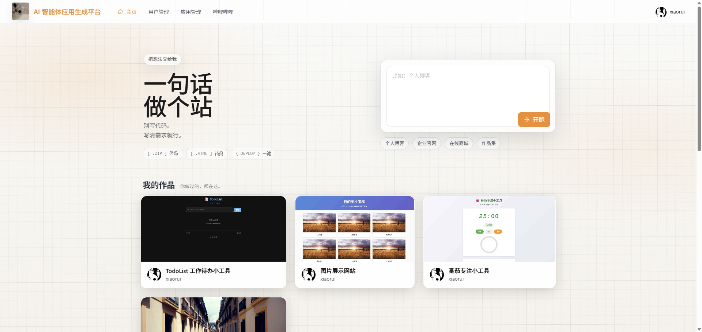
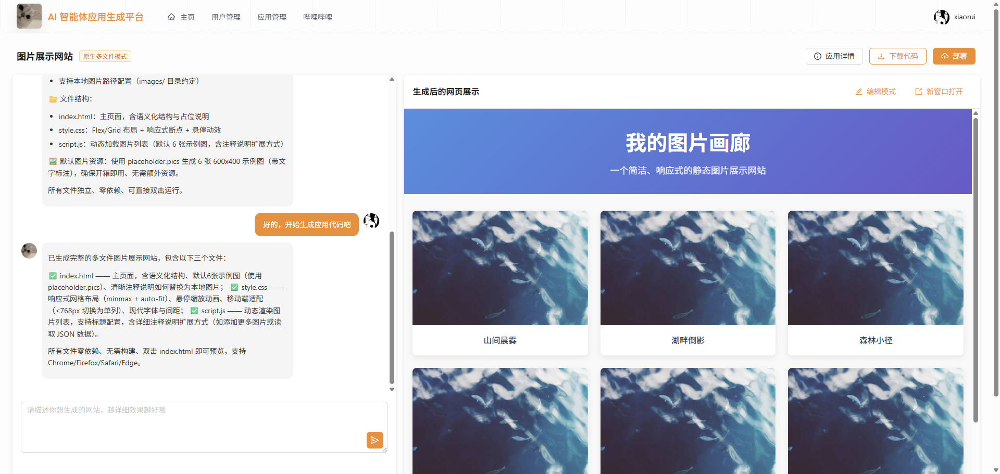
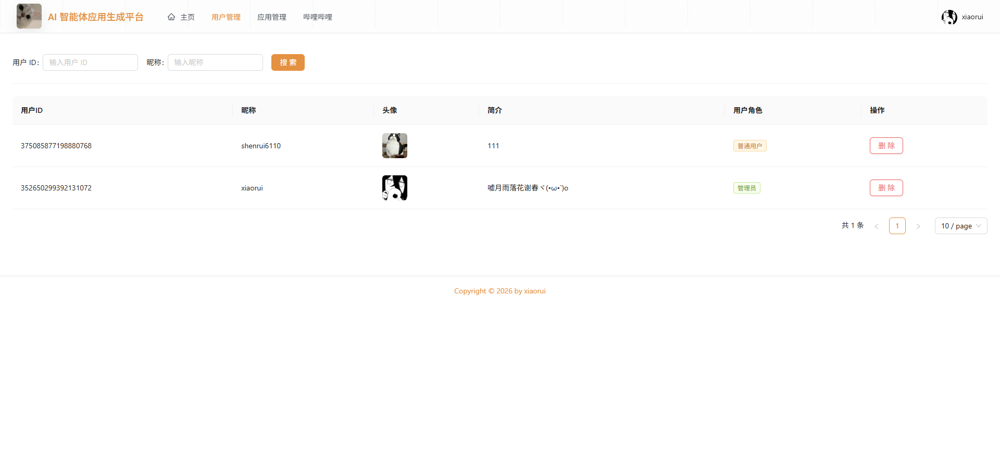
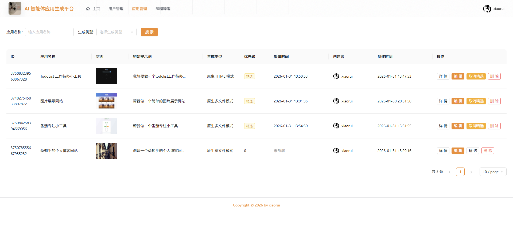

# AI 智能体应用生成平台（毕设）
> 基本上全是参考 Spring AI Alibaba https://github.com/alibaba/spring-ai-alibaba 进行自主学习，并持续优化中...

**_还有为了提交代码和新增功能方便，一些本地配置 key 等信息就没有忽略提交了，还请不要搞我呢(￣﹃￣)_**

# AI Intelligent Agent Application Generation Platform

## 项目简介

基于 Spring Boot + Spring AI Alibaba 构建的 AI 智能体应用生成平台，支持用户输入自然语言需求，自动生成可运行的小型应用代码文件等功能。

### 示例页面（AI 生成前端）









### 核心技术栈

| 技术/框架             | 版本/说明      | 用途             |
|-------------------|------------|----------------|
| Spring Boot       | 3.5.6      | 项目核心框架         |
| Spring AI Alibaba | 1.1.0.0 RC | 阿里通义千问 AI 模型调用 |
| MyBatis Flex      | 1.8.0      | 数据库操作          |
| Redis             | 7.4        | 缓存、分布式锁、状态管理   |
| MinIO             | 25-09-07   | 分布式文件存储        |
| MySQL             | 8.0+       | 关系型数据库         |
| JDK               | 21         | 基础开发环境，适配虚拟线程  |
| Maven             | 3.8.8      | 项目构建工具         |

### 项目结构

```
agent-application-creator/
├── src/
│   └── main/
│       ├── java/com/xiaorui/agentapplicationcreator/
│       │   ├── agent/              # 智能体核心逻辑
│       │   ├── common/             # 通用组件
│       │   ├── config/             # 配置类
│       │   ├── constant/           # 常量定义
│       │   ├── controller/         # 控制器层
│       │   ├── enums/              # 枚举类
│       │   ├── exception/          # 异常处理
│       │   ├── infrastructure/     # 基础设施层
│       │   ├── mapper/             # 数据访问层
│       │   ├── model/              # 数据模型
│       │   ├── service/            # 业务逻辑层
│       │   └── utils/              # 工具类
│       └── resources/
│           ├── application.yml              # 主配置文件
│           ├── application-dev.yml          # 开发环境配置
├── design/                      # 设计文档（图片）
├── pom.xml                      # Maven项目配置
└── README.md                    # 项目说明文档
```

## 环境要求

- JDK：21+（**推荐21**，适配虚拟线程）
- Maven：3.8.8+
- Git：任意版本
- 第三方服务：阿里云百炼 API_KEY 等

## 快速开始

### 1. 克隆项目

```bash
git clone https://github.com/xiaorio6110/agent-application-creator.git
cd agent-application-creator
```

### 2. 数据库初始化

```bash
# 创建数据库
mysql -u root -p
CREATE DATABASE xiaorui_app_creator CHARACTER SET utf8mb4 COLLATE utf8mb4_unicode_ci;
EXIT;

# 导入数据库表结构
mysql -u root -p xiaorui_app_creator < db/create_table.sql
```

### 3. 环境配置

修改 `src/main/resources/application-dev.yml` 文件，配置以下信息（当然不止以下这些，还有要预先创建 tmp/code_output 和 tmp/code_deploy 文件夹等等）：

```yaml
spring:
  datasource:
    url: jdbc:mysql://localhost:3306/xiaorui_app_creator?useUnicode=true&characterEncoding=utf8&serverTimezone=Asia/Shanghai&useSSL=false
    username: your_username
    password: your_password
  data:
    redis:
      host: 127.0.0.1
      port: 6379
      database: 3
    mongodb:
      uri: mongodb://127.0.0.1:27017/agent_memory_store
  ai:
    dashscope:
      api-key: your_dashscope_api_key

minio:
  endpoint: http://your-minio-server:9000
  access-key: your_access_key
  secret-key: your_secret_key
```

### 4. 安装依赖并启动

```bash
# 使用 Maven 编译项目
mvn clean install

# 运行项目
mvn spring-boot:run

# 或者直接运行 jar 包
java -jar target/agent-application-creator-0.0.1-SNAPSHOT.jar
```

### 5. 访问应用

- **应用地址**：http://localhost:8123/api
- **接口文档**：http://localhost:8123/api/doc.html

## 核心功能

### 1. 用户模块
- 用户注册/登录
- 个人信息管理
- 邮箱验证
- 密码重置

### 2. 智能体模块
- 自然语言对话交互
- 多智能体协同
- 代码生成智能体
- 代码优化智能体

### 3. 应用模块
- 应用自动生成
- 应用部署管理
- 应用下载
- 应用监控

### 4. 对话历史模块
- 对话记录保存
- 历史对话查询
- 上下文管理

### 5. 工程项目生成模块
- Vue 项目自动创建
- 项目结构生成
- 代码文件生成

### 6. RAG 模块
- 文档上传解析
- 知识库管理
- 代码规范 RAG
- 智能检索

### 7. 扩展功能
- 应用封面自动生成
- 文件上传下载
- 敏感词过滤
- 异步任务处理

## API 接口文档

项目集成了 Knife4j 接口文档，访问地址：`http://localhost:8123/api/doc.html`

主要接口分类：
- 用户管理：`/api/user/*`
- 智能体对话：`/api/agent/*`
- 应用管理：`/api/app/*`
- 对话历史：`/api/chatHistory/*`
- 任务管理：`/api/agentTask/*`

## 技术亮点

1. **虚拟线程优化**：利用 JDK 21 的虚拟线程提升并发性能
2. **分布式锁**：基于 Redisson 实现分布式锁，保证数据一致性
3. **多级缓存**：Redis + Caffeine 双级缓存策略
4. **异步处理**：异步任务队列处理耗时操作
5. **AI 智能体框架**：基于 Spring AI Alibaba 的智能体应用
6. **代码规范 RAG**：结合 RAG 技术实现代码规范智能检索
7. **多 Agent 协同**：主智能体 + 副智能体协同工作模式
8. **文件存储**：MinIO 分布式文件存储
9. **监控告警**：集成 Prometheus + Grafana 监控
10. **接口文档**：Knife4j 自动生成接口文档

## 项目文档

详细的设计文档请参考 `doc/` 目录：

| 文档                                | 说明         |
|-----------------------------------|------------|
| 0-MustFirstRead.md                | 项目必读文档     |
| 1-ProjectInitialization.md        | 项目初始化指南    |
| 2-UserModuleDesign.md             | 用户模块设计     |
| 3-AgentModuleDesign.md            | 智能体模块设计    |
| 4-AppModuleDesign.md              | 应用模块设计     |
| 5-ChatHistoryModuleDesign.md      | 对话历史模块设计   |
| 6-VueProjectCreateModuleDesign.md | Vue 项目创建模块 |
| 7-ExtendedFeaturesModuleDesign.md | 扩展功能模块     |
| 8-SubAgentMuduleDesign.md         | 副智能体模块设计   |
| 9-RagModuleDesign.md              | RAG 模块设计   |
| 10-SystemOptimizationDesign.md    | 系统优化设计     |

## 开发计划

### 已完成
- ✅ 用户注册登录
- ✅ 智能体对话
- ✅ 应用代码生成
- ✅ 对话历史管理
- ✅ Vue 项目创建
- ✅ 文件上传下载
- ✅ MinIO 集成
- ✅ Redis 缓存
- ✅ RAG 知识库

### 进行中
- ⏰ 应用评论系统
- ⏰ 应用分类和排行榜
- ⏰ 用户社交功能

### 计划中
- 📚 MCP 模型上下文协议接入
- 📚 图片搜索集成
- 📚 网络搜索集成
- 📚 智能体上下文工程优化
- 📚 可观测性监控完善

## 常见问题

### 1. 启动时连接数据库失败
检查数据库配置是否正确，确保 MySQL 服务已启动且端口可访问。

### 2. Redis 连接超时
确保 Redis 服务已启动，检查 `application-dev.yml` 中的 Redis 配置。

### 3. MinIO 文件上传失败
检查 MinIO 服务是否正常运行，确认 endpoint、access-key 和 secret-key 配置正确。

### 4. AI 对话无响应
检查阿里云百炼 API Key 是否正确，确保账户有足够的调用额度。

## 联系方式

- 作者：xiaorui
- 邮箱：368649957@qq.com
- 项目地址：[GitHub Repository](https://github.com/xiaorui6110/agent-application-creator)
