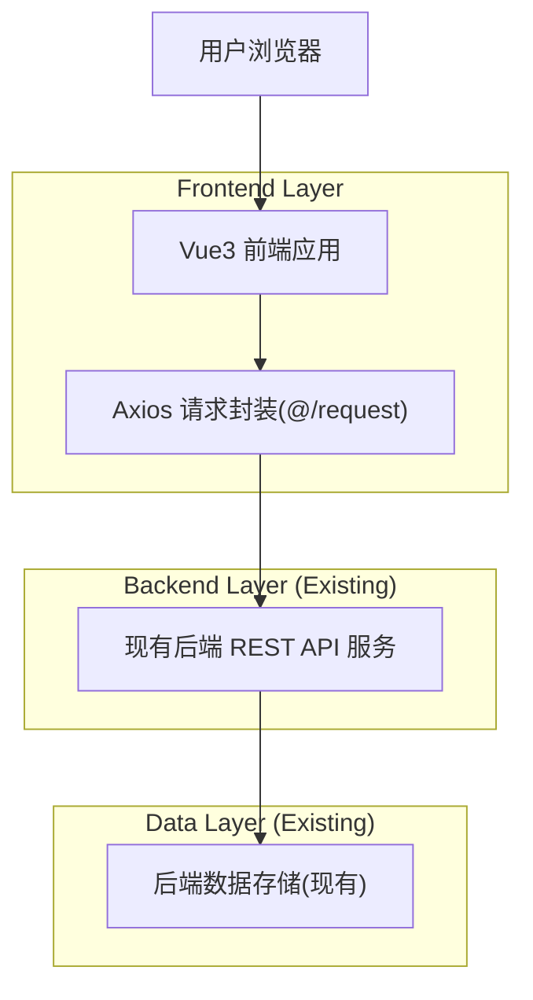
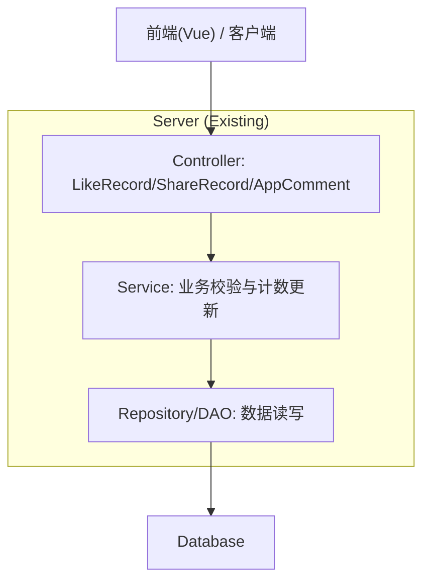
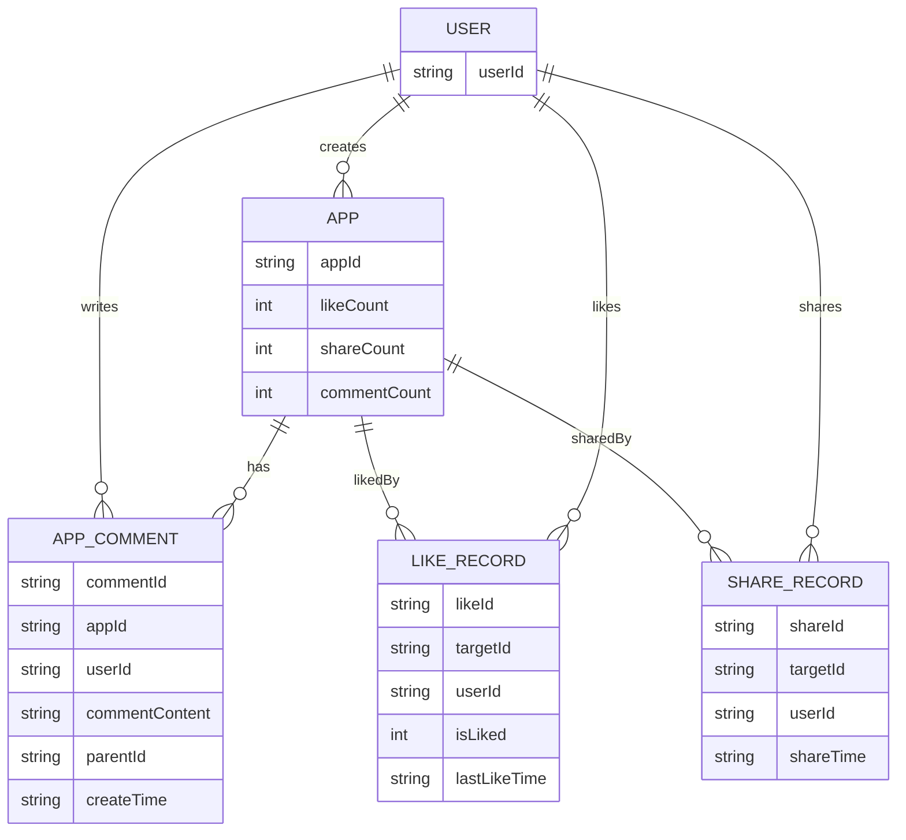

## 1.Architecture design



## 2.Technology Description
- Frontend: Vue@3 + TypeScript + vite + ant-design-vue@4 + pinia + axios
- Backend: 现有后端 REST API（前端通过 OpenAPI 生成的 `src/api/*Controller.ts` 调用）
- Database: 现有后端自带（本仓库不包含）

## 3.Route definitions
| Route | Purpose |
|-------|---------|
| / | 主页：应用列表 + AppCard 点赞/分享入口 |
| /app/chat/:id | 应用对话页：详情头部点赞/分享入口 + 打开应用详情弹窗并在评论 Tab 交互 |
| /user/login | 登录：用于执行点赞/分享/评论等需要身份的操作 |
| /user/register | 注册：创建账号以登录 |
| /user/reset-password | 重置密码：账号找回 |

## 4.API definitions

### 4.1 点赞（应用维度）
```
POST /likeRecord/do
GET  /likeRecord/status/{targetId}
```
请求（POST body，沿用现有 typings）：
| Param Name | Param Type | isRequired | Description |
|-----------|------------|------------|-------------|
| targetId | string | true | 目标应用 ID（AppVO.appId） |
| isLiked | number | true | 1=点赞，0=取消点赞 |

响应：
| Param Name | Param Type | Description |
|-----------|------------|-------------|
| data | boolean | 是否操作成功 |

### 4.2 分享（应用维度）
```
POST /shareRecord/do
GET  /shareRecord/status/{targetId}
```
请求（POST body，字段以已生成 typings 为准）：
| Param Name | Param Type | isRequired | Description |
|-----------|------------|------------|-------------|
| shareId | string | true | 分享目标标识（由后端定义；前端按 OpenAPI 生成类型传参） |
| isShared | number | true | 1=分享，0=取消分享 |

响应：
| Param Name | Param Type | Description |
|-----------|------------|-------------|
| data | boolean | 是否操作成功 |

### 4.3 评论（应用维度）
```
POST /appComment/query
POST /appComment/add
POST /appComment/delete
```

- 查询评论（/appComment/query）请求（POST body）：
| Param Name | Param Type | isRequired | Description |
|-----------|------------|------------|-------------|
| appId | string | true | 目标应用 ID |
| current | number | false | 页码 |
| pageSize | number | false | 每页数量 |

- 新增评论（/appComment/add）请求（POST body）：
| Param Name | Param Type | isRequired | Description |
|-----------|------------|------------|-------------|
| appId | string | true | 目标应用 ID |
| commentContent | string | true | 评论内容 |
| parentId | string | false | 父评论 ID（本次方案可不启用，保留兼容） |

- 删除评论（/appComment/delete）请求（POST body）：
| Param Name | Param Type | isRequired | Description |
|-----------|------------|------------|-------------|
| commentId | string | true | 评论 ID |

### 4.4 前端共享类型（节选）
```ts
// App 侧用于展示的计数（已存在于 AppVO）
export type AppVO = {
  appId?: string
  commentCount?: number
  likeCount?: number
  shareCount?: number
}

export type LikeDoRequest = { targetId?: string; isLiked?: number }
export type ShareDoRequest = { shareId?: string; isShared?: number }
export type AppCommentAddRequest = { appId?: string; commentContent?: string; parentId?: string }
export type AppCommentQueryRequest = { appId?: string; current?: number; pageSize?: number }
export type AppCommentDeleteRequest = { commentId?: string }
```

## 5.Server architecture diagram
（后端已存在，本图为交互功能的通用分层示意）



## 6.Data model(if applicable)

### 6.1 Data model definition
（基于现有 OpenAPI typings 推导的概念模型，用于前后端对齐字段含义）



### 6.2 Data Definition Language
本仓库仅包含前端；后端数据表与 DDL 沿用既有实现，本次仅对接既有 API，无需在前端维护 DDL。
