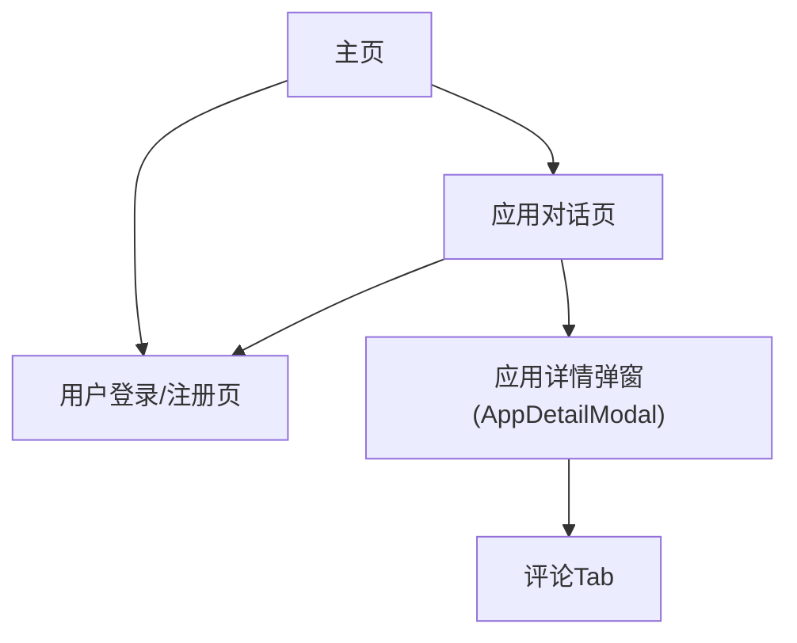

## 1. Product Overview
为应用增加“点赞 / 分享 / 评论”互动能力，提升作品曝光与用户参与度。
互动入口按方案1落地：点赞/分享在 AppCard 与详情页头部；评论在 AppDetailModal 的评论 Tab。

## 2. Core Features

### 2.1 User Roles
| 角色 | 注册方式 | 核心权限 |
|------|----------|----------|
| 游客 | 无需注册 | 可浏览应用列表与应用详情；可查看点赞/分享/评论数量与评论列表（只读） |
| 登录用户 | 邮箱注册/登录 | 可对应用点赞/取消点赞、分享/取消分享；可发布评论、删除自己的评论 |

### 2.2 Feature Module
我们的互动功能需求由以下页面构成：
1. **主页**：应用卡片列表、卡片点赞/分享入口与计数展示、跳转应用对话页。
2. **应用对话页**：详情头部点赞/分享入口与计数、打开“应用详情”弹窗、在弹窗评论 Tab 查看与发布评论。
3. **用户登录/注册页**：完成登录/注册以执行点赞/分享/评论等需要身份的操作。

### 2.3 Page Details
| Page Name | Module Name | Feature description |
|-----------|-------------|---------------------|
| 主页 | 应用卡片互动区（AppCard） | 展示点赞数/分享数；点击后调用现有 API 完成点赞/取消、分享/取消；未登录时引导登录 |
| 主页 | 状态与反馈 | 在操作中显示 loading；操作成功后更新计数与按钮状态；失败时提示错误信息 |
| 应用对话页 | 详情头部互动区 | 在页面头部展示点赞/分享按钮与计数；支持点赞/取消、分享/取消；未登录时引导登录 |
| 应用对话页 | 应用详情弹窗入口 | 点击“应用详情”打开 AppDetailModal；弹窗内提供“基础信息/评论”分栏 |
| 应用对话页 | AppDetailModal-评论 Tab | 拉取并展示评论列表；支持发表评论；支持删除自己的评论；无数据展示空状态 |
| 用户登录/注册页 | 登录态保障 | 登录成功后返回原页面（如通过 query 传递 redirect）；保证互动操作在登录后可继续执行 |

## 3. Core Process

### 游客/登录用户通用浏览流程
你在主页浏览应用卡片，看到每个应用的点赞数/分享数，并可进入“应用对话页”查看/使用该应用。

### 点赞流程（方案1）
- 主页：你点击 AppCard 上的“点赞”按钮。
  - 若未登录：跳转登录页，登录成功后返回并可再次执行点赞。
  - 若已登录：调用现有点赞 API，成功后更新按钮状态与点赞计数。
- 应用对话页：你在详情头部点击“点赞”，流程同上。

### 分享流程（方案1）
- 主页或应用对话页：你点击“分享”。
  - 若未登录：跳转登录页。
  - 若已登录：调用现有分享 API 完成分享/取消分享，并更新计数与状态。

### 评论流程（方案1）
- 你在应用对话页点击“应用详情”打开 AppDetailModal。
- 切换到“评论”Tab：系统拉取该应用的评论列表并展示。
- 你输入评论并提交：调用现有评论新增 API；成功后刷新/追加到列表。
- 你可删除自己的评论：调用现有评论删除 API；成功后从列表移除。

