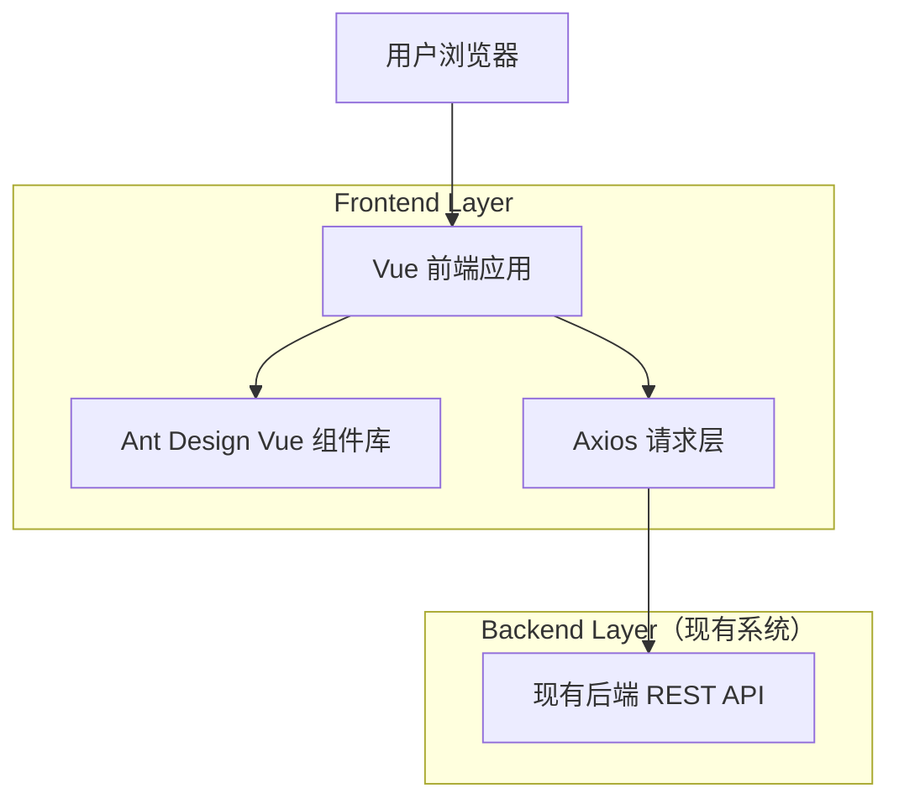

## 1.Architecture design

## 2.Technology Description
- Frontend: Vue@3 + vue-router@4 + pinia@3 + ant-design-vue@4 + vite
- Backend: None（本项目仅作为前端消费既有后端 API）

## 3.Route definitions
| Route | Purpose |
|-------|---------|
| / | 首页：创建应用入口、我的作品、精选案例 |
| /user/login | 用户登录：邮箱+密码+图形验证码 |
| /user/register | 用户注册：邮箱+密码+邮箱验证码 |
| /user/reset-password | 重置密码：找回与重置流程入口 |
| /user/settings | 账号设置：账号信息与安全相关操作 |
| /app/chat/:id | 应用对话：对话生成 + 右侧预览 + 部署/下载 |
| /app/edit/:id | 编辑应用：修改应用名称（管理员可编辑封面） |
| /admin/userManage | 用户管理（管理员） |
| /admin/appManage | 应用管理（管理员） |
| /admin/chatManage | 对话管理（管理员） |
