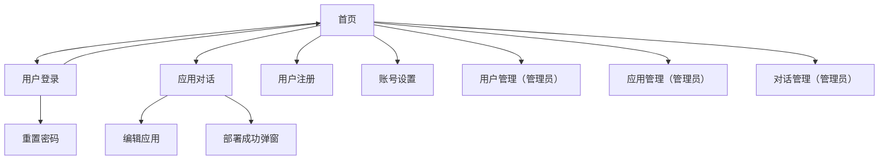

## 1. Product Overview
在不改变现有业务流程与接口的前提下，对「鱼皮 AI 应用生成」前端进行页面美化与一致性改造。
首批聚焦用户高频主路径页面，统一配色、排版、间距、卡片与交互反馈，提高质感与可读性。

## 2. Core Features

### 2.1 User Roles
| 角色 | 注册/登录方式 | 核心权限 |
|------|--------------|----------|
| 游客 | 无需注册 | 可浏览首页、查看精选案例、触发“创建应用”时被引导登录 |
| 登录用户 | 邮箱注册/登录 | 可创建应用、进入应用对话页生成内容、下载代码、部署、编辑自己的应用信息、账号设置 |
| 管理员 | 后端分配角色 | 可访问管理页面（用户管理/应用管理/对话管理），可编辑更多应用字段（如封面） |

### 2.2 Feature Module
首批页面美化需求由以下页面组成：
1. **全局布局与导航**：顶部导航、用户区（登录/头像下拉）、页脚、内容容器宽度与留白。
2. **首页**：Hero 区、提示词输入框与发送按钮、快捷示例按钮、我的作品/精选案例卡片网格与分页。
3. **登录 / 注册 / 重置密码**：统一表单卡片布局、输入与按钮样式、提示文案与帮助链接。
4. **应用对话页**：顶部工具栏、左右分栏（对话/预览）、消息气泡与滚动区、选中元素提示、输入框区、预览占位/加载/错误态、弹窗。
5. **编辑应用页**：页面标题区、表单卡片与字段层级、封面预览块、应用信息描述区。

### 2.3 Page Details
| Page Name | Module Name | Feature description |
|-----------|-------------|---------------------|
| 全局布局与导航 | 设计一致性基线 | 统一基础留白、内容最大宽度、标题层级、按钮/链接/Tag 的风格；不改变菜单权限逻辑与跳转行为。 |
| 全局布局与导航 | 顶部导航与用户区 | 保持现有信息架构与入口不变；优化对齐、间距、hover/active 状态与可点击区域；统一头像与下拉菜单视觉。 |
| 首页 | Hero 区 | 保持“AI 应用生成平台/一句话轻松创建网站应用”语义不变；提升标题/描述排版、背景层级与可读性。 |
| 首页 | 提示词输入与发送 | 保持创建流程不变；优化输入框层级、聚焦态、错误提示与发送按钮可发现性。 |
| 首页 | 快捷示例按钮 | 保持示例文案与点击填充逻辑不变；统一按钮样式、密度与换行策略。 |
| 首页 | 应用卡片网格与分页 | 保持卡片内容与点击行为不变；统一卡片尺寸、阴影、边框、封面比例、操作按钮层级；分页位置与信息密度更清晰。 |
| 登录/注册/重置密码 | 表单卡片 | 保持字段、校验规则与提交逻辑不变；统一卡片宽度、标题/描述、表单间距、错误态与按钮层级。 |
| 登录/注册/重置密码 | 辅助链接与提示 | 保持跳转入口不变；统一链接样式、对齐方式与弱提示颜色。 |
| 应用对话页 | 顶部工具栏 | 保持“应用详情/下载代码/部署”功能与权限不变；优化按钮分组、主次关系、禁用态与 loading 反馈。 |
| 应用对话页 | 对话区（消息/历史/输入） | 保持消息内容与发送逻辑不变；统一消息气泡、头像、代码块/Markdown 容器、滚动条与空/加载态；提升输入区可用性与键盘交互提示。 |
| 应用对话页 | 选中元素提示条 | 保持信息字段不变；优化信息密度、可读性、代码样式与关闭交互。 |
| 应用对话页 | 预览区（iframe） | 保持预览加载逻辑不变；优化占位、加载、错误态的视觉与操作引导；统一预览头部与操作按钮样式。 |
| 编辑应用页 | 表单与预览块 | 保持字段权限与不可编辑项不变；优化表单层级、字段说明、封面预览区域与卡片头部风格。 |
| 编辑应用页 | 应用信息描述区 | 保持信息字段不变；优化 Descriptions 的信息密度、对齐、分组与弱化背景。 |
| 全局（首批范围） | 验收标准 | 满足：1) 不新增/删除业务功能与入口；2) 视觉规范在首批页面统一落地；3) 关键状态（空/加载/错误/禁用/hover/focus）在首批页面覆盖；4) 桌面端 1440/1280/1024 与移动端 768 下无横向滚动与明显错位。 |

## 3. Core Process
**普通用户主流程**：你进入首页输入应用描述 → 未登录时跳转登录 → 登录成功回到首页 → 创建应用成功进入应用对话页 → 在对话区继续描述需求生成内容 → 右侧预览更新 →（可选）下载代码 / 部署 →（可选）进入编辑应用页修改名称（管理员可改封面）。

**管理员补充流程**：管理员登录后可通过顶部菜单进入用户管理/应用管理/对话管理页面进行运营与审核。

